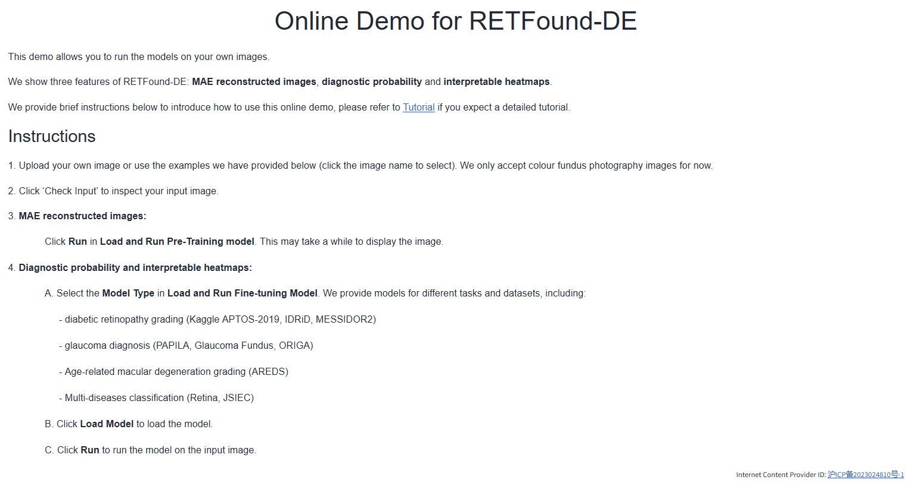

# DERETFound - Generative Model Enables Ultra-High Data Efficiency for Building Generalist Medical Foundation Model

DERETFound is a medical foundation model from retinal images that enables ultra-high data efficiency. 

This is the official repo for DERETFound, which is based on [MAE](https://github.com/facebookresearch/mae) and [RETFound](https://github.com/rmaphoh/RETFound_MAE/tree/main) (Y. Zhou et al, Nature 2023):

## News
- [x] Release the code of DERETFound
- [ ] Release the code of retinal-image diffusion model
- [ ] Provide the Online demo for retinal-image diffusion

## Key features

- **Ultra-High Data Efficiency:** DERETFound enables ultra-high data efficiency and only uses 16.7% of the colour fundus photography retinal image required in RETFound.
- **Excellent performance:** Extensive experiments on nine datasets across four ocular disease detection tasks demonstrate the excellent performance of DERETFound in improving the detection of eye diseases, label and fine-tuning time efficiency.
- **Transferable:** DERETFound provides an effective solution for other diseases that were once discouraged from building foundation models due to limited data, which has profound significance for generalist medical AI.


## Online Demo
We provide a live demo for DERETFound at [http://fdudml.cn:12001/](http://fdudml.cn:12001/). You can also  employ the following steps to run the demo locally.



## Prepare the environment

1. Download the pre-training and fine-tuning model

You can download the finetuned models from [here]() and the examples of DERETFound from [here](https://github.com/Jonlysun/DERETFound/releases/tag/data). Then, you can unzip the file and put the folder `exampledata` and `checkpoint` in the root directory of DERETFound.
    
```
exampledata/
    AMD/
    DR/
    Glaucoma/
    Multi-disease/

checkpoint/
     AMD_AREDS/
     DR_APTOS2019/
     DR_IDRID/
     DR_MESSIDOR2/
     Glaucoma_Glaucoma_Fundus/
     Glaucoma_ORIGA/
     Glaucoma_PAPILA/
     Multi_JSIEC/
     Multi_Retina/
     PreTraining/
```

2. Install enviroment

Create enviroment with conda:

```
conda create -n deretfound python=3.8 -y
conda activate deretfound
```
Install Pytorch 1.13 (cuda 11.7)
```
pip install torch==1.13.0+cu117 torchvision==0.14.0+cu117 -f https://download.pytorch.org/whl/torch_stable.html
```

Install others
```
git clone https://github.com/Jonlysun/DERETFound/
cd DERETFound
pip install -r requirement.txt
```

## Offline Demo
### User Interface for DERETFound

You can run the web interface locally by the following command:
```
python app.py
```

Then, you can visit the web interface at [http://127.0.0.1:7891/](http://127.0.0.1:7860/). You can upload your own image or use our examples to run DERETFound.

### Visualize with code
We also provide a `visualize.py` to generate the **MAE reconstructed images**, **diagnostic probability** and **interpretable heatmaps**. Your can run the following command:
```
# MAE reconstructed images. Result is the 'mae.png'
python visualize.py --mode mae --img_path XXXX

# Diagnostic probability. Result is the 'classification.png'
python visualize.py --mode classification --img_path XXXX --ft_model XXXX (e.g., DR_APTOS2019)

# Interpretable heatmaps. Result is the 'cam.png'
python visualize.py --mode cam --img_path XXXX --ft_model XXXX (e.g., DR_APTOS2019)
```

## Evaluate or fine-tune DERETFound
### 1. Prepare the datasets
- Firstly, you can download the public dataset following the url in `Data availability` in our paper. 
- Then, you can split the dataset into train, val, test datasets following the Supplementary Table 1 in our paper 
- Finally, generate three 'train.pkl', 'val.pkl', 'test.pkl' files containing the information about 'img_root' and 'label' for each dataset. (using IDRiD as an example)

We use IDRiD as an [example](Example.ipynb). 
```
data/
    IDRiD/
        train.pkl
        val.pkl
        test.pkl
```
If you want to follow the same split in our paper, you can download '.pkl' files from [here](https://github.com/Jonlysun/DERETFound/releases/tag/data). Also, you may need to post-process these files with your own path.

### 2. Evaluation
You can use the following command or run the 'bash main_evaluation.sh'. Please remember replace the root path with your own dataset path
```
# chose the dataset
DATASET='DR_APTOS2019'
python -m torch.distributed.launch --nproc_per_node=1 --master_port=48797 main_finetune.py \
    --eval --batch_size 16 \
    --world_size 1 \
    --model vit_large_patch16 \
    --epochs 50 \
    --blr 5e-3 --layer_decay 0.65 \
    --weight_decay 0.05 --drop_path 0.2 \
    --nb_classes 5 \
    --root YOUR_OWN_DATASET_PATH \
    --task ./Results/internal_$DATASET/ \
    --resume ./checkpoint/$DATASET/checkpoint-best.pth \
    --dataset_name $DATASET
```
### 3. Fine-tuning
You can use the following command or run the 'bash main_finetune.sh'. Please remember replace the root path with your own dataset path
```
# chose the dataset
DATASET='DR_APTOS2019'
python -m torch.distributed.launch --nproc_per_node=1 --master_port=40003 main_finetune.py \
    --batch_size 64 \
    --world_size 1 \
    --model vit_large_patch16 \
    --epochs 50 \
    --blr 5e-3 --layer_decay 0.65 \
    --weight_decay 0.05 --drop_path 0.2 \
    --root YOUR_OWN_DATASET_PATH \
    --task ./Results/$DATASET/  \
    --dataset_name $DATASET \
    --finetune ./checkpoint/PreTraining/checkpoint-best.pth

```

## Pre-Training
You can use the following command or run the 'bash main_pretrain.sh'. Please remember replace the root path with your own dataset path
```
IMAGE_DIR='YOUR_IMAGE_DIR'
python -m torch.distributed.launch --nproc_per_node=8 main_pretrain.py \
    --batch_size 224 \
    --model mae_vit_large_patch16 \
    --norm_pix_loss \
    --mask_ratio 0.75 \
    --epochs 200 \
    --warmup_epochs 20 \
    --blr 1.5e-4 --weight_decay 0.05 \
    --data_path ${IMAGE_DIR} \
    --task './DERETFound/' \
    --output_dir './DERETFound_log/' \
    --resume ./mae_pretrain_vit_large.pth \

```
Please contact 	**sunyuqi387@gmail.com** if you have questions.
