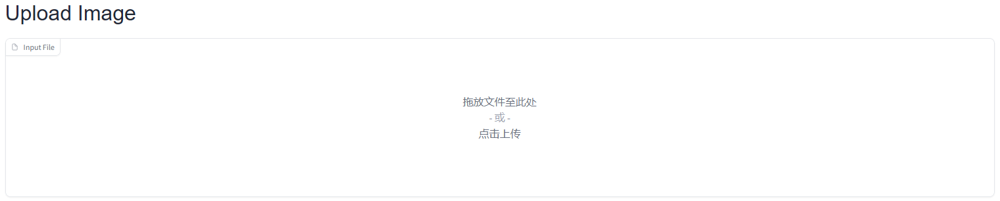
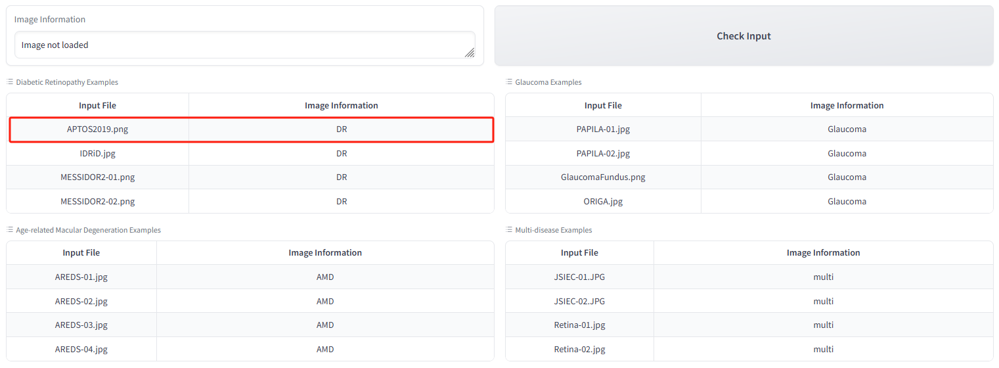
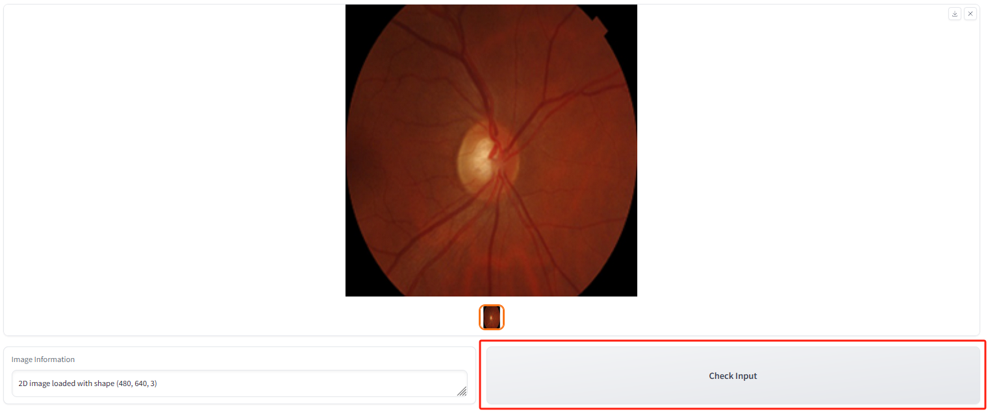
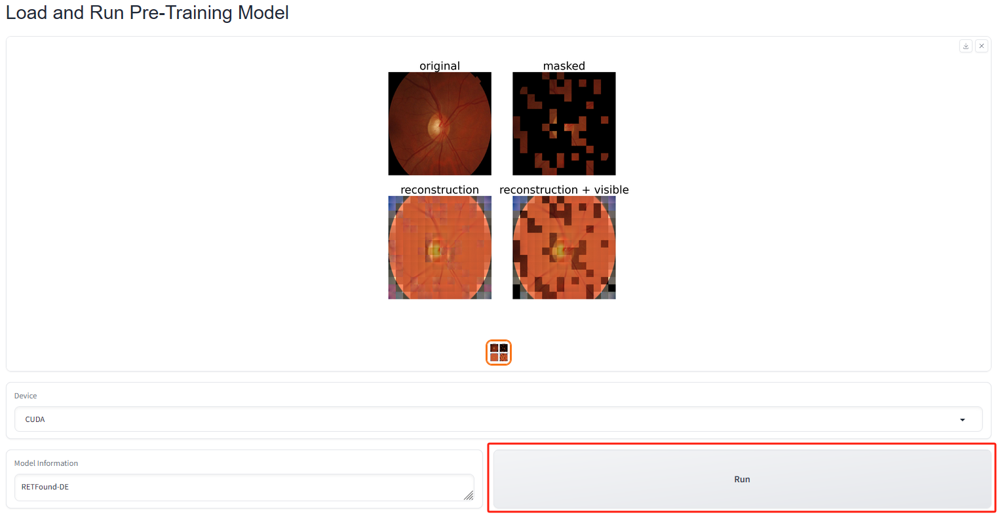
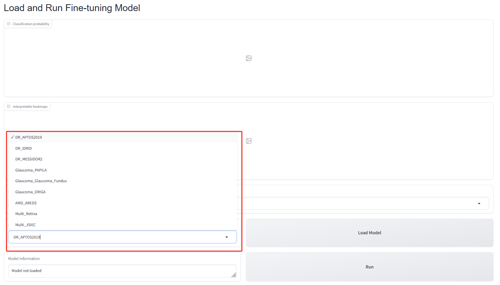
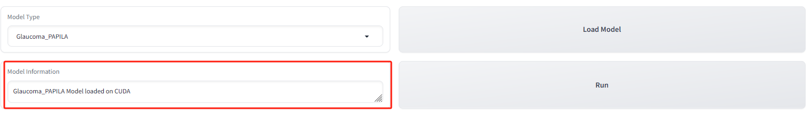
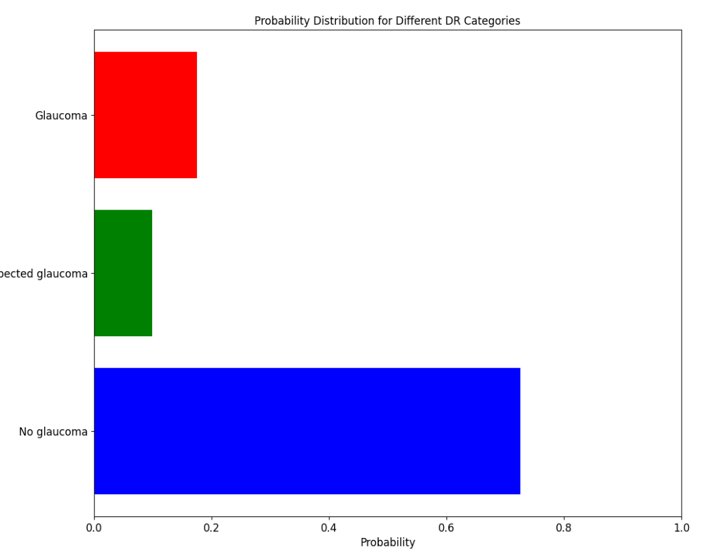
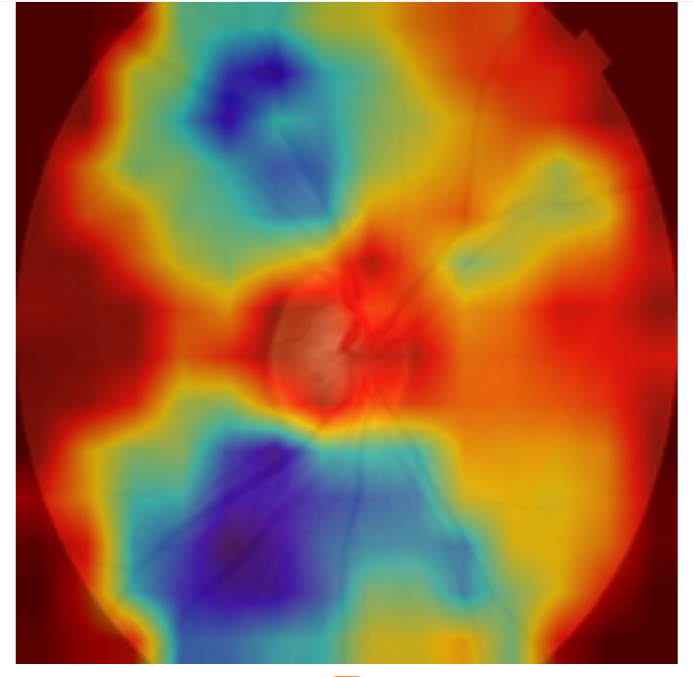

# Tutorial for online demo

Here we provide a detailed introduction to the use of the [online demo](http://fdudml.cn:12001/) for RETFound-DE. 

In the demo, we offer three features, including:

- MAE reconstructed images: We show the input and output of MAE self-supervision.
- Diagnostic probability: We present the diagnostic probability for diseases by RETFound-DE in the form of a bar chart.
- Interpretable heatmaps: We display the heatmap of model inference on the input retinal image.

Below, we provide a detailed introduction to the specific usage process.

## Upload Image

Online demo starts with uploading images. 

Users can upload their own fundus image by clicking here

Also, users can use the images we have provided. Click the image name to select the image like below:

Finally, click the **Check input** to visualize the input image.

## MAE reconstructed images (Optional)
After uploading an image, you can click **Run** in **Load and Run Pre-Training model** if you want to the reconstructed images of MAE.

- "Masked" is the masked image of original image and the input seet into RETFound-DE. 
- "Reconstruction" is the output of our self-supervised pre-training Model RETFound-DE.
- "Reconstruction + Visible" is the result of the fusion of "Reconstruction" and "Masked".

## Diagnostic probability and Interpretable heatmaps:

Before you can get the disease diagnosis probability and interpretable heatmaps, you first need to select the disease diagnosis task and model type.

We provide models for different tasks and datasets, including:
- diabetic retinopathy grading (Kaggle APTOS-2019, IDRiD, MESSIDOR2)
- glaucoma diagnosis (PAPILA, Glaucoma Fundus, ORIGA)
- Age-related macular degeneration grading (AREDS)
- Multi-diseases classification (Retina, JSIEC)

Each dataset above represents a fine-tuned downstream model. Please note that different downstream task datasets may represent different classification tasks. For example, For example, glaucoma diagnosis is a three-category task on PAPILA but a two-category task on ORIGA.

### Step 1: We can select the 'Model Type' in 'Load and Run Fine-tuning Model' like this:

### Step 2: Click 'Load Model' to load the model. This may take a while.
After successfully loading the model, we can see the correct model information.

### Step 3: Click 'Run' to run the model on the input image.
Once you have successfully run the model, the online demo will show a disease diagnostic probability bar chart like:

and an heatmaps to indicate how the model make the decision:

